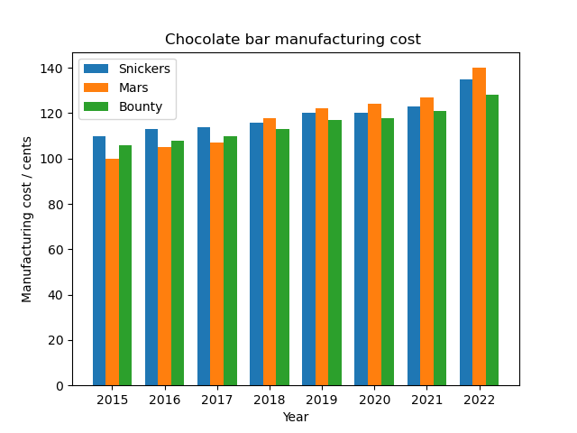

# Overview  

Please see blog site https://devbuildit.com/2023/02/04/more-matpoltlib-graphs-using-aws-jupyter-notebooks/ for detailed explaination of this repo contents.

This repo (and associated blog) will help you to produce a plot as shown below using Jupyter Notebooks on AWS infrastructure.

